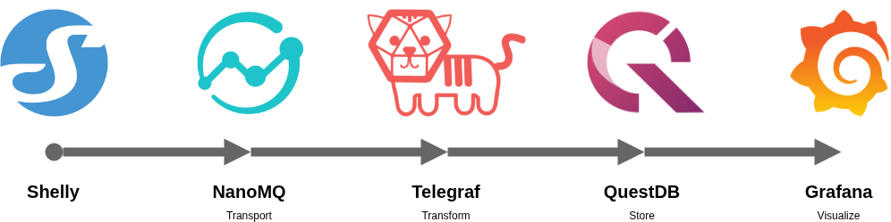

# Shelly Dashboard

A lightweight monitoring setup for Shelly devices over MQTT.

## What it IS

- Self-hosted, without relying on cloud services.
- Optimized for low resource consumption, ideal for running on Raspberry Pis or similar low-power devices.
- Highly customizable and extensible. Use the entire stack or only parts of it. Telegraf supports a wide range of outputs, and Grafana offers numerous plugins and visualization options.

## What it is NOT

- A full-fledged home automation system. It focuses on monitoring and visualization rather than control or automation. The communication is one-way: Shelly devices publish their status via MQTT, and this setup collects and visualizes that data.
- Secured by default. There is no encryption or authentication configured for most services. It is recommended to implement appropriate security measures based on your deployment environment.
- A Out-of-the-box solution - some assembly required. Grafana contains no pre-built dashboards. Likewise, I do not have every Shelly device, you may need to add parsers yourself. Contributions are welcome!

## Setup

1. Ensure you have Docker and Docker Compose installed on your system.
2. Run `docker-compose up -d` in the project directory to start all services.
3. Configure your Shelly device's MQTT settings; set the broker address (default: `<host-ip>:1883`) and keep the default MQTT prefix, this allows Telegraf to parse the Shelly model and device ID. Also, disable "MQTT Control" and "RPC over MQTT".
4. Access Grafana at `http://<host-ip>:3000` (default credentials: admin/admin) and have fun creating dashboards!

### Hardware Requirements

Min. 1 GB of RAM, that's it.

## Compatibility

Tested with the following Shelly devices:

- 3EM-63 Gen3
- Shelly Plus1PM
- Shelly Plus AddOn + DS18B20 temperature sensor
- 1 Mini Gen3

Works for the following MQTT topics:

- `+/status/switch:*`
- `+/status/em:*`
- `+/status/emdata:*`
- `+/status/temperature:*`
- `+/status/sys:*`

## Development

The main work is done by Telegraf, adding support for new topics is done by adding a consumer to `./telegraf/telegraf.conf`. Once messages are parsed correctly, you can validate the data in QuestDB by using the web interface at `http://<host-ip>:9000`.

### Future improvements

- Add support for more Shelly devices.
- Handle data gaps for devices with local storage.
- Add pre-configured Grafana dashboards for common Shelly devices.
- Improve security options.

## History

- **19. November 2025** Project start.
